<div align="center">


[](https://git.io/typing-svg)

<br/>



<br/>


</div>

---

## 👾 About Me

```yaml
> whoami
──────────────────────────────────────────────────
  Name      : Gerard Carré
  Role      : IT Systems & Network Administrator
  Location  : Catalonia, Spain
  Languages : Català · Español · English
  Focus     : Systems Administration + AI
  Status    : [ Building · Learning · Growing ]
──────────────────────────────────────────────────
```

- 🖥️ **Sysadmin** — Gestión de infraestructura, redes y sistemas en activo
- 🤖 **AI Explorer** — Aprendiendo LLMs, agentes IA y automatización inteligente
- 🔧 **Builder** — Proyectos personales: asistentes IA, bots y herramientas
- 📡 **Always Online** — Apasionado por cómo los sistemas tecnológicos se conectan
- ⚡ **Goal 2025** — Unir el conocimiento de infraestructura IT con capacidades de IA

---

## 📊 GitHub Stats

<div align="center">


<br/><br/>


</div>

---

## 📈 Activity Graph

<div align="center">


</div>

---

## 🏆 Trophies

<div align="center">


</div>

---

<div align="center">


</div>
